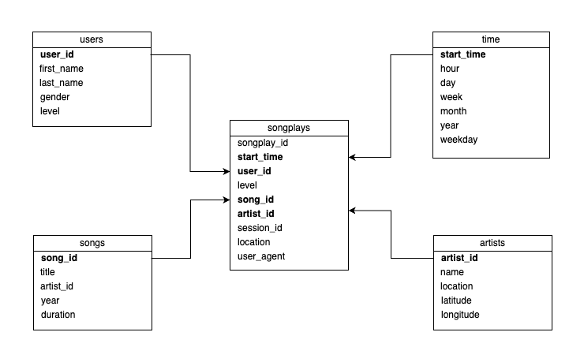

# AWS Data Warehouse Project

## Scenario
A music streaming startup, Sparkify, has grown their user base and song database and want to move their processes and data onto the cloud. Their data resides in S3, in a directory of JSON logs on user activity on the app, as well as a directory with JSON metadata on the songs in their app.

As their data engineer, you are tasked with building an ETL pipeline that extracts their data from S3, stages them in Redshift, and transforms data into a set of dimensional tables for their analytics team to continue finding insights into what songs their users are listening to.

## Database and ETL Design

## Sample Queries

- What is the most played song?
- Who is the most popular artist?
- When is highest usage time of day by hour for songs?

For example, what is the most played song? When is the highest usage time of day by hour for songs? It would not take much to imagine what types of questions that corporate users of the system would find interesting. Including those queries and the answers makes your project far more compelling when using it as an example of your work to people / companies that would be interested. You could simply have a section of sql_queries.py that is executed after the load is done that prints a question and then the answer.